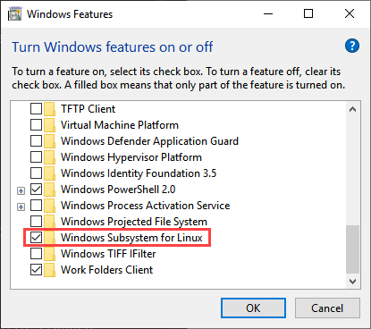
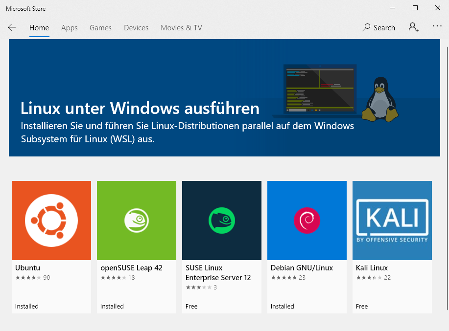
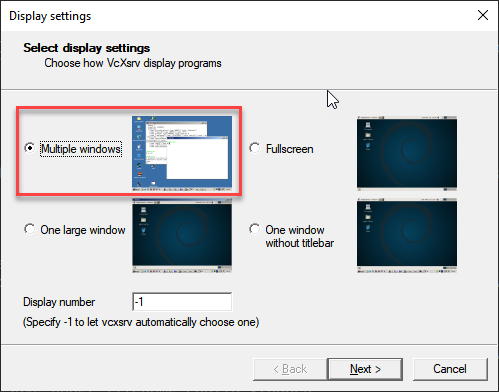
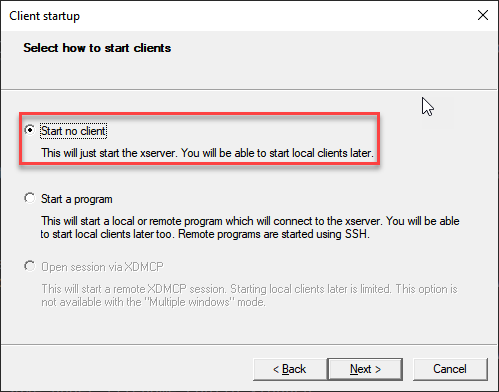
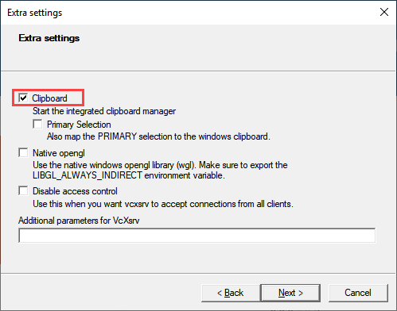
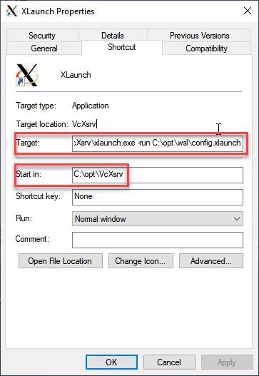
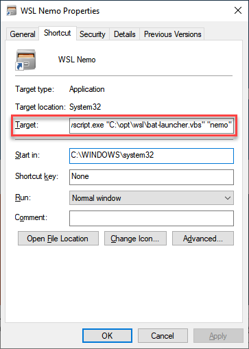
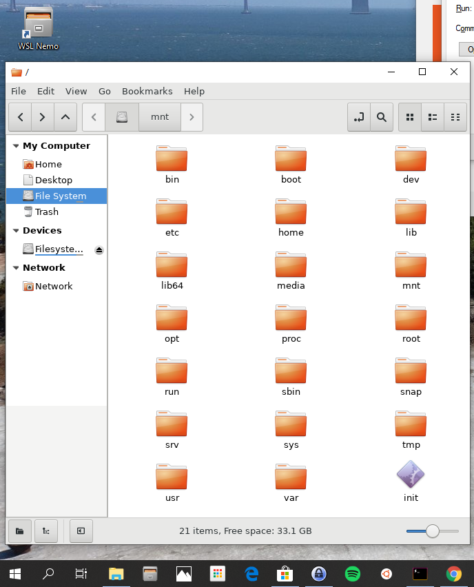

Step 1 - Install WSL
--------------------
Download and install the latest [Windows 10 Creators Update](https://www.microsoft.com/de-de/software-download/windows10). 
`Right Click Windows Start -> Settings -> Apps -> Apps & features -> Programs and Features -> Turn Windows features on
or off`.

Select Checkbox `Windows Subsystem for Linux`.



Alternatively you can enter following command in PowerShell to enable WSL:
```bash
Enable-WindowsOptionalFeature -Online -FeatureName Microsoft-Windows-Subsystem-Linux
```
In the Microsoft Store select the WSL-Version of your liking and install it.



You can install more than one Linux-Distribution and select a default:
1. Start `CMD` in Windows
2. Type `wslconfig /l` which lists all installed Linux distributions.
3. Type `wslconfig /setdefault <DistributionName>` for selecting the default.

Step 2 - Install Hyper
----------------------
Hyper is a Terminal Emulator for Windows. Download and install [Hyper](https://hyper.is/) in Windows.
Open Hyper and select `Edit -> Preferences`. Change in the File `hyper.js` following:

```bash
shell: 'C:\\Windows\\System32\\bash.exe'
```

Now the default Command-Line for Hyper is the WSL-Bash. Close Hyper, open CMD and enter `hyper install hyper-snazzy` for
installing a theme.

Step 3 - Install VcXsrv
-----------------------
VcXsrv is a X-Server for Windows. We can use it for Open Graphic-Applications from WSL in Windows.
Download and install [VcXsrv](https://sourceforge.net/projects/vcxsrv/) in Windows. Start VcXsrv with `xlaunch.exe`. Do
now following steps:

* Configuration Step 1: Select `Multiple windows`



* Configuration Step 2: Select `Start no client`
and Primary Selection


* Configuration Step 3: Select `Clipboard`. Unselect `Primary Selection`, `Native opengl` and `Disable access control`.
We will use real OpenGL in Linux.



* Configuration Step 4: Press the Button `Save configuration` and save under the filename `C:\opt\wsl\config.xlaunch`.
Press the Button `Finish` and the XLaunch system tray icon in Windows appears.

In order to do not this configurations steps again before each launching, we create a shortcut on the Windows Desktop
with following preferences:



```bash
Target: C:\opt\VcXsrv\xlaunch.exe -run C:\opt\wsl\config.xlaunch
Start in: C:\opt\VcXsrv
```

`C:\opt\VcXsrv` is the Windows-Folder i have installed VcXsrv.

Step 4 - Install Graphical Environment
--------------------------------------
Connect with Hyper in WSL.
```bash
sudo echo "export DISPLAY=:0" >> ~/.bashrc
source ~/.bashrc
sudo apt-get update
sudo apt-get upgrade
sudo apt-get install nemo
sudo apt-get install libgtk-3-dev libswt-gtk-3-java
```
With installing the filemanager nemo all necessary UI-Libaries will be installed.

Step 5 - Shortcuts in Windows
-----------------------------
To start the WSL programs directly in Windows some shortcuts on the desktop are useful.

Step 1: Create a folder `C:\opt\wsl`

Step 2: Create a file named `bat-launcher.vbs` in `C:\opt\wsl` with following content:

```
If WScript.Arguments.Count <= 0 Then
    WScript.Quits
End If	

bat = Left(WScript.ScriptFullName, InStrRev(WScript.ScriptFullName, "\")) & WScript.Arguments(0) & ".bat"
arg = ""

If WScript.Arguments.Count > 1 Then
    arg = WScript.Arguments(1)
End If

CreateObject("WScript.Shell").Run """" & bat & """ """ & arg & """", 0, False
```

Step 3: Create a file named `nemo.bat` in `C:\opt\wsl` with following content:

```
C:\Windows\System32\bash.exe -c "export DISPLAY=:0 && nemo"
```

Step 4: On the windows desktop create a new shortcut and browse to the location `C:\opt\wsl\nemo.bat`


Step 5: Right click on the shortcut and edit the properties as follows:



```
Target: C:\Windows\System32\wscript.exe "C:\opt\wsl\bat-launcher.vbs" "nemo"
```

The `bat-launcher.vbs` script prevent showing up a console window.

Now you can open the Nemo-Filemanager from the Linux-Distribution in Windows.



Links
-----
* https://char.gd/blog/2017/how-to-set-up-the-perfect-modern-dev-environment-on-windows
* https://medium.com/@mfosullivan/a-beginners-guide-to-setting-up-a-modern-web-development-environment-on-windows-10-4d75cd94cde8
* https://blogs.msdn.microsoft.com/commandline/2016/11/17/do-not-change-linux-files-using-windows-apps-and-tools/
* https://github.com/Microsoft/WSL/issues/2855
* https://www.zdnet.com/article/how-to-run-run-the-native-ubuntu-desktop-on-windows-10/
* https://token2shell.com/howto/x410/creating-shortcut-for-wsl-gui-desktop/
* https://askubuntu.com/questions/979331/windows-subsystem-for-linux-desktop-shortcut-to-gui
* https://medium.com/@myrlandnu/guide-to-install-and-configure-hyper-for-windows-10-52a829c97b25
* https://docs.microsoft.com/en-us/windows/wsl/wsl-config
* https://dzone.com/articles/installing-openjdk-11-on-ubuntu-1804-for-real
* https://github.com/int128/idea-fsnotifier-wsl
* https://github.com/guard/listen/wiki/Increasing-the-amount-of-inotify-watchers
* https://medium.com/@at15/ubuntu-change-fs-inotify-max-user-watches-for-idea-f5f5d6651e7f
* https://confluence.jetbrains.com/display/IDEADEV/Inotify+Watches+Limit (Increase value in
/proc/sys/fs/inotify/max_user_watches from 8192 to 524288)
